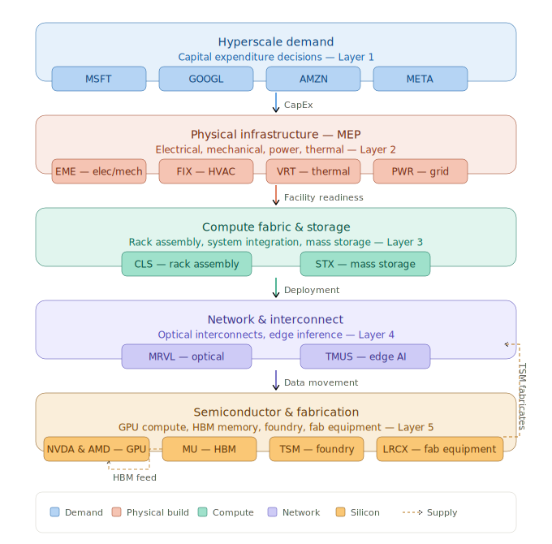

# AI CapEx Economy — Value Chain

A structural diagram mapping the AI capital expenditure economy, from hyperscale demand through physical infrastructure, compute, networking, and semiconductor fabrication — annotated with publicly traded companies at each layer.



---

## Five-layer architecture

### Layer 1 — Hyperscale demand
The top of the value chain. MSFT, GOOGL, AMZN, and META collectively commit hundreds of billions in annual CapEx to build AI-capable infrastructure. Their spending decisions cascade down every layer below.

| Ticker | Role |
|--------|------|
| MSFT | Azure AI, OpenAI partnership, Copilot infrastructure |
| GOOGL | GCP, TPU development, Gemini deployment |
| AMZN | AWS Trainium/Inferentia, Bedrock platform |
| META | Llama training clusters, ~$65B 2025 CapEx guidance |

### Layer 2 — Physical infrastructure & MEP
Mechanical, electrical, and plumbing (MEP) contractors who build and fit out the data center shell. Facility readiness — reliable power, cooling, and physical space — is the bottleneck before compute can be deployed.

| Ticker | Role |
|--------|------|
| EME | Electrical and mechanical contracting |
| FIX | HVAC and liquid cooling systems |
| VRT | Thermal management and power distribution hardware |
| PWR | Grid connection and power infrastructure |

### Layer 3 — Compute fabric & storage
System integrators who assemble GPU racks and provide the mass storage infrastructure needed for training data and model weights.

| Ticker | Role |
|--------|------|
| CLS | Rack assembly and system integration |
| STX | Mass data storage (HDDs, nearline) |

### Layer 4 — Network & interconnect
The data movement layer. High-speed optical interconnects tie GPU clusters together inside the data center; edge AI extends inference to the network edge.

| Ticker | Role |
|--------|------|
| MRVL | Optical interconnects, custom AI silicon (XPUs) |
| TMUS | Edge AI deployment and connectivity infrastructure |

### Layer 5 — Semiconductor & fabrication
The physical foundation. GPU compute engines, high-bandwidth memory, foundry services, and the atomic-scale equipment that makes it all possible.

| Ticker | Role |
|--------|------|
| NVDA | GPU compute (H100, B200 series) — dominant AI accelerator |
| AMD | GPU/CPU compute (MI300X) — growing hyperscaler share |
| MU | HBM (High Bandwidth Memory) — feeds NVDA/AMD GPUs |
| TSM | Foundry (TSMC) — manufactures NVDA, AMD, MRVL silicon |
| LRCX | Fab equipment (Lam Research) — enables TSM process nodes |

---

## Key value flows

```
Hyperscale CapEx → MEP contractors → Facility readiness → Rack deployment
                                                         ↑
Silicon (TSM) → GPU/ASIC → Rack assembly (CLS) ─────────┘
         ↑
HBM (MU) ─┘

TSM also fabricates: MRVL (optical ASICs), MU (DRAM/HBM dies)
LRCX supplies equipment to TSM for each process node generation
```

---

## Files

| File | Description |
|------|-------------|
| `diagram.svg` | Rendered SVG — embeds directly in GitHub markdown |
| `diagram.mmd` | Mermaid source — edit this to change the diagram |
| `README.md` | This file |
| `NOTES.md` | Extended MBA-style value chain analysis |

---

## Diagram source

The `diagram.mmd` file contains the Mermaid source. To re-render to SVG locally:

```bash
npx @mermaid-js/mermaid-cli -i diagram.mmd -o diagram.svg
```

Or paste `diagram.mmd` into [mermaid.live](https://mermaid.live) for a quick preview.

---

## Perspectives

**As an architect:** The five layers map to distinct procurement categories — civil/MEP, systems integration, networking, and silicon. Each layer has different lead times, supplier concentration risk, and price elasticity. The TSM bottleneck (one foundry for leading-edge nodes) is the single point of failure for the entire stack.

**As an MBA:** Value accrues disproportionately to layer 1 (hyperscalers set terms) and layer 5 (NVDA pricing power is near-monopolistic). Layers 2–4 are more competitive and margin-compressed. The exception is MRVL, which is capturing value through custom silicon (XPUs) commissioned directly by hyperscalers — effectively moving from Layer 4 into a Layer 5 dynamic.

---

*Diagram updated: 2025. Tickers for reference only — not investment advice.*
